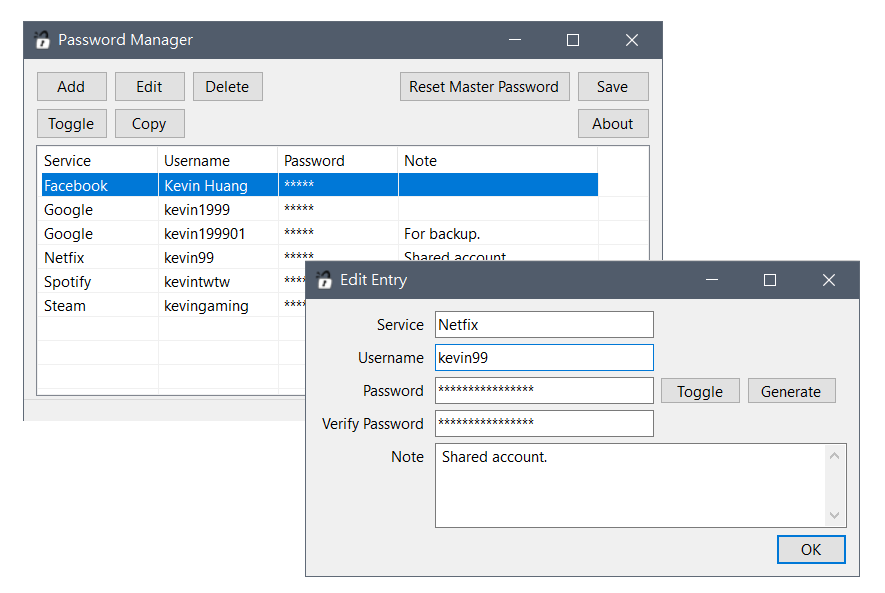

# PasswordManager

A simple local password manager for Windows, made with Windows Forms (.Net).
Basically, it use the SHA256 hashing and AES encryption algorithm provide by .NET API under the 
[Security.Cryptography](https://learn.microsoft.com/en-us/dotnet/api/system.security.cryptography?view=net-8.0) namespace to 
store the master password and encrypt all the passwords.

### Features

* Add, edit, and delete password entries.
* Memorize one master password to access all the saved password entries.
* Temporally copy password to clipboard without showing it on screen by double click.
* Generating new random passwords with cryptographic security.

The path to the password data file is `$HOME\.pmdata`, which stores all the encrypted data.

### Screenshot

